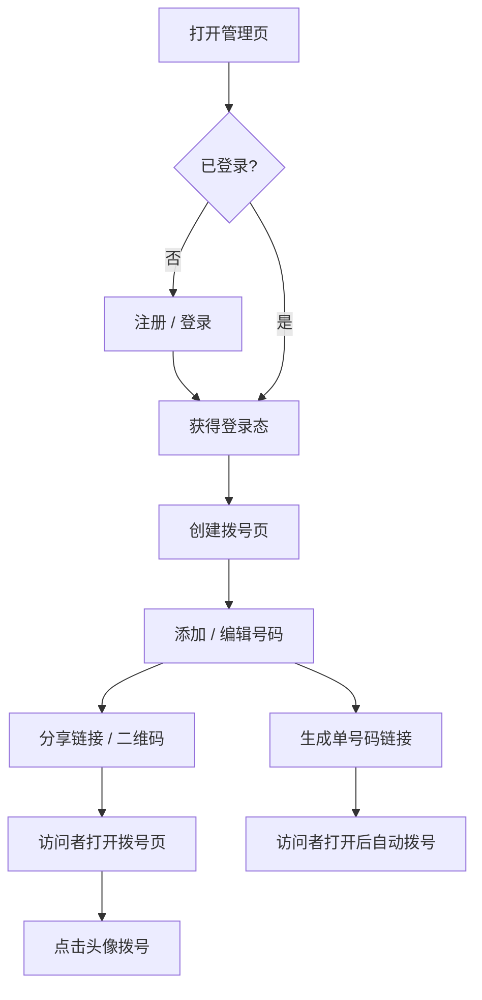

# 产品需求文档（PRD）

## 1. 产品概述
一个「快速拨打电话」的网页应用：用户用手机号注册登录后，可创建多个拨号页，每个拨号页生成唯一链接与二维码用于分享；访问者打开链接即可看到通讯录，点击头像一键拨出电话。面向需要向客户/团队/访客快速分发可点击拨号通讯录的场景。

## 2. 核心功能

### 2.1 用户角色
| 角色 | 注册方式 | 核心权限 |
|------|----------|----------|
| 普通用户 | 手机号 + 密码 | 注册 / 登录、创建与管理拨号页、增删改号码、分享链接与二维码 |

### 2.2 功能模块
1. **登录注册**：手机号 + 密码注册（注册成功自动登录）、手机号 + 密码登录。
2. **管理页（拨号页列表）**：登录后创建/删除/编辑拨号页，复制分享链接、生成二维码。
3. **拨号页编辑**：添加/删除/修改号码，配置手机号、头像、名称、背景色、字体大小；为单个号码生成独立分享链接。
4. **公开拨号页**：根据配置加载通讯录，自适应列数展示头像与名称，点击头像拨号。
5. **单号码分享**：打开具体号码链接后自动拨号。

### 2.3 页面详情
| 页面名称 | 模块名称 | 功能描述 |
|---------|---------|---------|
| 登录页 | 登录表单 | 手机号 + 密码登录，成功后进入管理页 |
| 注册页 | 注册表单 | 手机号 + 密码 + 重复密码，注册成功提示并自动登录 |
| 管理页 | 拨号页列表 | 展示当前用户全部拨号页，支持创建、删除、进入编辑 |
| 管理页 | 分享模块 | 展示拨号页分享链接与二维码，一键复制 |
| 拨号页编辑页 | 基本信息 | 修改拨号页名称、页面背景（颜色/图片）、默认字体大小 |
| 拨号页编辑页 | 号码管理 | 增删改号码，配置手机号/头像/名称/背景色/字体大小，生成单号码链接 |
| 公开拨号页 | 通讯录展示 | 按 1~3 列自适应展示头像 + 名称，点击头像直接拨号 |
| 公开拨号页 | 单号码模式 | 加载具体号码链接后自动拨号 |

## 3. 核心流程

### 3.1 主流程

### 3.2 关键规则
- **注册**：只需手机号、密码、重复密码；校验手机号格式、两次密码一致、手机号未注册；成功后提示「注册成功」并自动登录。
- **唯一链接**：每个拨号页创建时自动生成唯一 slug，作为分享链接的一部分。
- **头像兜底**：未上传头像时，取「名称最后 2 个字」作为头像文字，并用「手机号计算出的固定背景色」作为头像底色。
- **自适应列数**：依据「屏幕宽度」与「设置的字体大小」，以每行最多 3 列、最少 1 列的方式展示（列数 = 1~3 之间自适应）。
- **自动拨号**：访问具体号码链接时，页面加载后自动发起 `tel:` 拨号。

## 4. 用户界面设计

### 4.1 设计风格
- **主色**：暖中性底色 + 品牌强调色（珊瑚橙 / 信号绿），用于主按钮与选中态。
- **按钮**：圆角、柔和阴影，具备悬停与按压反馈。
- **字体**：中文使用系统字体，电话号码使用几何无衬线字体以增强可读性与记忆点。
- **布局**：卡片式布局，管理页顶部导航 + 内容网格，拨号页以大号头像网格为核心。
- **图标**：线性简洁图标，风格统一。

### 4.2 页面设计概述
| 页面名称 | 模块名称 | UI 元素 |
|---------|---------|---------|
| 登录页 | 登录表单 | 居中卡片、手机号/密码输入框、登录按钮、跳转注册 |
| 注册页 | 注册表单 | 居中卡片、手机号/密码/重复密码输入框、注册按钮 |
| 管理页 | 拨号页列表 | 顶部导航、新建按钮、卡片网格、每个卡片含分享/二维码/编辑/删除 |
| 拨号页编辑页 | 基本信息 | 名称输入、背景颜色选择器、背景图上传、字体大小滑杆 |
| 拨号页编辑页 | 号码管理 | 号码卡片列表、新增号码表单、头像上传、单号码链接复制 |
| 公开拨号页 | 通讯录展示 | 自适应网格头像卡片、名称、点击拨号热区 |

### 4.3 响应式
- **桌面优先**：管理页、编辑页按桌面布局设计，宽屏下卡片网格展示。
- **移动端适配**：拨号页针对触屏优化点击热区；列数随屏幕宽度与字体大小在 1~3 列间动态切换。
