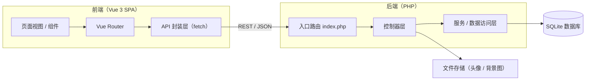
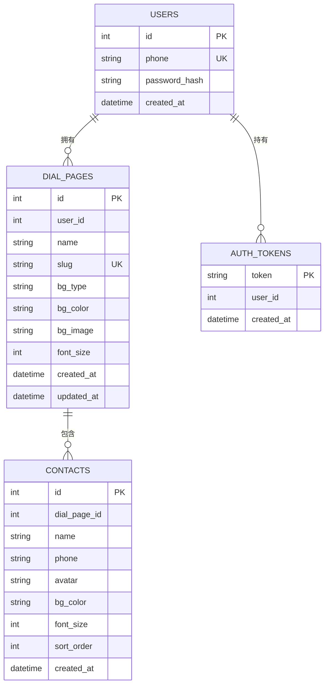

# 技术架构文档

## 1. 架构设计



## 2. 技术说明
- **前端**：Vue 3 + TypeScript + Vite + TailwindCSS + Vue Router。
- **后端**：PHP 8（原生、无框架，单一入口路由 + 控制器分层）。
- **数据库**：SQLite（PDO，零配置，适合本地运行与快速部署）。
- **认证**：手机号 + 密码（`password_hash` 存储），登录/注册后返回随机 Bearer Token。
- **文件存储**：头像与背景图上传至 `backend/storage/uploads`，通过后端静态路径访问。

## 3. 路由定义

### 3.1 前端路由
| 路由 | 用途 |
|------|------|
| `/login` | 登录页 |
| `/register` | 注册页 |
| `/admin` | 管理页（拨号页列表，需登录） |
| `/admin/page/:id` | 拨号页编辑页（需登录） |
| `/d/:slug` | 公开拨号页（无需登录） |
| `/d/:slug/:contactId` | 单号码分享页（加载后自动拨号） |

### 3.2 后端 API 路由
| 方法 | 路由 | 用途 | 鉴权 |
|------|------|------|------|
| POST | `/api/auth/register` | 注册并自动登录 | 否 |
| POST | `/api/auth/login` | 登录 | 否 |
| GET | `/api/auth/me` | 获取当前用户 | 是 |
| GET | `/api/dial-pages` | 拨号页列表 | 是 |
| POST | `/api/dial-pages` | 创建拨号页 | 是 |
| GET | `/api/dial-pages/:id` | 拨号页详情（含号码） | 是 |
| PUT | `/api/dial-pages/:id` | 更新拨号页 | 是 |
| DELETE | `/api/dial-pages/:id` | 删除拨号页 | 是 |
| POST | `/api/dial-pages/:id/contacts` | 新增号码 | 是 |
| PUT | `/api/contacts/:id` | 更新号码 | 是 |
| DELETE | `/api/contacts/:id` | 删除号码 | 是 |
| POST | `/api/upload` | 上传文件（头像/背景图） | 是 |
| GET | `/api/public/dial-page/:slug` | 公开获取拨号页 | 否 |
| GET | `/api/public/contact/:slug/:contactId` | 公开获取单号码 | 否 |

## 4. API 定义

统一响应包裹：`{ "code": 0, "message": "ok", "data": ... }`；`code` 非 0 表示错误。

### 4.1 认证
```
POST /api/auth/register
请求：{ "phone": "13800138000", "password": "123456" }
响应：{ "code": 0, "data": { "token": "...", "user": { "id": 1, "phone": "13800138000" } } }

POST /api/auth/login
请求：{ "phone": "13800138000", "password": "123456" }
响应：同上

GET /api/auth/me（Authorization: Bearer <token>）
响应：{ "code": 0, "data": { "id": 1, "phone": "13800138000" } }
```

### 4.2 拨号页
```
GET /api/dial-pages
响应：{ "code": 0, "data": [ { "id", "name", "slug", "bg_type", "bg_color", "bg_image", "font_size", "contact_count" } ] }

POST /api/dial-pages
请求：{ "name": "公司通讯录" }
响应：{ "code": 0, "data": { "id", "name", "slug", ... } }

PUT /api/dial-pages/:id
请求：{ "name", "bg_type": "color|image", "bg_color", "bg_image", "font_size" }
响应：{ "code": 0, "data": { ... } }

DELETE /api/dial-pages/:id
响应：{ "code": 0 }
```

### 4.3 号码
```
POST /api/dial-pages/:id/contacts
请求：{ "name", "phone", "avatar", "bg_color", "font_size" }
响应：{ "code": 0, "data": { "id", ... } }

PUT /api/contacts/:id
请求：同新增（可部分更新）
响应：{ "code": 0, "data": { ... } }

DELETE /api/contacts/:id
响应：{ "code": 0 }
```

### 4.4 文件上传
```
POST /api/upload（multipart/form-data，字段 file）
响应：{ "code": 0, "data": { "url": "/uploads/xxx.png" } }
```

### 4.5 公开访问
```
GET /api/public/dial-page/:slug
响应：{ "code": 0, "data": { "id", "name", "slug", "bg_type", "bg_color", "bg_image", "font_size", "contacts": [ { "id", "name", "phone", "avatar", "bg_color", "font_size" } ] } }

GET /api/public/contact/:slug/:contactId
响应：{ "code": 0, "data": { "contact": { "id", "name", "phone", "avatar" }, "page": { "name" } } }
```

## 5. 数据模型

### 5.1 ER 图



### 5.2 数据定义语言（DDL）

```sql
CREATE TABLE IF NOT EXISTS users (
  id INTEGER PRIMARY KEY AUTOINCREMENT,
  phone TEXT UNIQUE NOT NULL,
  password_hash TEXT NOT NULL,
  created_at DATETIME DEFAULT CURRENT_TIMESTAMP
);

CREATE TABLE IF NOT EXISTS auth_tokens (
  token TEXT PRIMARY KEY,
  user_id INTEGER NOT NULL,
  created_at DATETIME DEFAULT CURRENT_TIMESTAMP
);

CREATE TABLE IF NOT EXISTS dial_pages (
  id INTEGER PRIMARY KEY AUTOINCREMENT,
  user_id INTEGER NOT NULL,
  name TEXT NOT NULL,
  slug TEXT UNIQUE NOT NULL,
  bg_type TEXT NOT NULL DEFAULT 'color',
  bg_color TEXT NOT NULL DEFAULT '#0f172a',
  bg_image TEXT NOT NULL DEFAULT '',
  font_size INTEGER NOT NULL DEFAULT 20,
  created_at DATETIME DEFAULT CURRENT_TIMESTAMP,
  updated_at DATETIME DEFAULT CURRENT_TIMESTAMP
);

CREATE TABLE IF NOT EXISTS contacts (
  id INTEGER PRIMARY KEY AUTOINCREMENT,
  dial_page_id INTEGER NOT NULL,
  name TEXT NOT NULL,
  phone TEXT NOT NULL,
  avatar TEXT NOT NULL DEFAULT '',
  bg_color TEXT NOT NULL DEFAULT '',
  font_size INTEGER DEFAULT NULL,
  sort_order INTEGER NOT NULL DEFAULT 0,
  created_at DATETIME DEFAULT CURRENT_TIMESTAMP
);

CREATE INDEX IF NOT EXISTS idx_dial_pages_user ON dial_pages(user_id);
CREATE INDEX IF NOT EXISTS idx_contacts_page ON contacts(dial_page_id);
```
